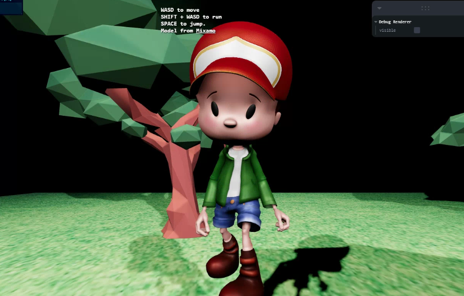

## How To Use

```bash
# Clone this repository
$ git clone https://github.com/PabloOch/model-interactive-fiber.git
# Go into the repository
$ cd model-interactive-fiber

# Install dependencies
$ npm install

# Run the app
$ npm start
```

Once the app is on you can go to `http://localhost:3000` to validate the model fetching.